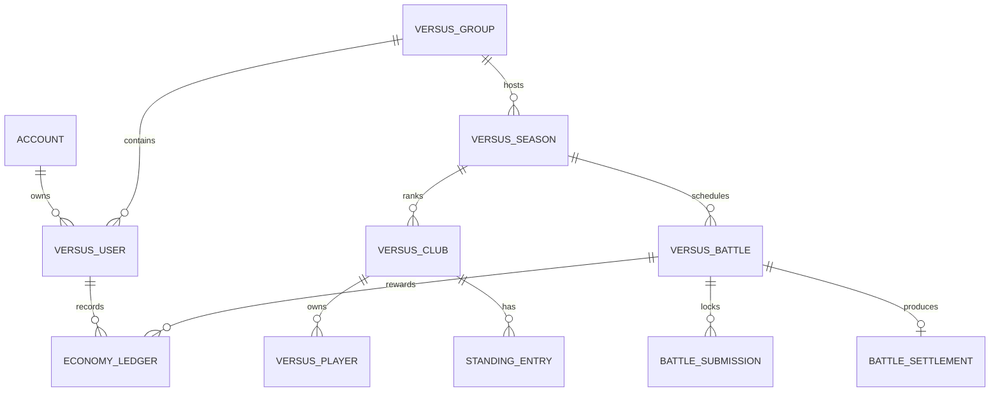

# Versus Mode — Deep Concept Specification

**Project:** DISCORDFC  
**Mode:** Versus Mode online  
**Date:** 2026-08-22  
**Research corpus:** 30 classified references in `docs/VERSUS_30_REFERENCE_MANIFEST.md`.

## 1. Product definition

Versus Mode is a **first-class online mode**, separate from Player Mode and Coach Mode. Player Mode follows one athlete's career. Coach Mode follows one retired-star coach and a managed club. Versus Mode places users and their Versus clubs into an online group/season competition where fixtures, roster state, player condition, battle results, rewards, and standings are synchronized.

The public App Store screenshot shows separate Player Mode, Coach Mode, and Versus Mode entry points. Official Korean release metadata indexed for the app mentions group-code functionality, advanced scouting, and player-status improvement in battle mode. NamuWiki reports that battle mode unlocks after completing a Coach season. The recovered client contains a dedicated Versus runtime and save model. Together, these sources establish Versus as an online/group competition layer, while the exact transport and real-time behavior remain unknown. [1] [2] [3] [4]

## 2. Recommended online model

Two interpretations are possible:

| Model | Description | Evidence fit | Recommendation |
|---|---|---|---|
| **Asynchronous group league** | Users submit club state before a round deadline; server/time procedure resolves a scheduled home-away battle and users retrieve the result later. | Strongly supported by `Time`, `ProcessSeasonMatch`, `OnTimeChanged`, compact battle payload, group fields, and side rewards. | **Build first.** |
| **Real-time PvP match** | Two users enter a live lobby and make simultaneous or turn-based tactical decisions. | Group-code evidence supports online participation, but no lobby, transport, presence, or server protocol is recovered. | Defer until explicitly confirmed. |

The first DISCORDFC version should therefore be **online but asynchronous**. This is not a compromise in product identity: it preserves online group competition, deadlines, rival users, standings, and rewards while matching the strongest recovered evidence and Discord's command-based UX.

## 3. Core domain model



| Aggregate | Required state |
|---|---|
| `VersusUser` | Account ID, group ID, club ID, status, current season/league, enrollment timestamp, last processed time. |
| `VersusGroup` | Group ID, invite code, owner/admin, capacity, season ID, membership status, ruleset version. |
| `VersusSeason` | Season ID, league ID, group ID, grade, start/end time, current round, round deadline, season state. |
| `VersusClub` | Club ID, owner, name/icon, country/grade, roster version, formation, tactic, budget, score, W/D/L, goals for/against, rank. |
| `VersusPlayer` | Player ID, age, property value, position, captain flag, ability map, HP, status, injury type/end time, yellow cards, red-card ban count, growth type. |
| `VersusBattle` | Battle ID, season/league/group/round, home/away club, scheduled time, status, simulation seed, locked snapshots, result reference. |
| `BattleSubmission` | Battle ID, club ID, owner, lineup, substitutes, formation, tactic, captain, roster version, submitted time, lock time. |
| `BattleSettlement` | Battle ID, score, goals, ball control, shots, shots on target, corners, cards, MVP, player stats, rewards, settled time, ruleset version. |
| `StandingEntry` | Club ID, score/points, rank, W/D/L, goals for/against, goal difference, tie-break fields. |
| `EconomyLedger` | Account, mode, currency, delta, reason, battle/season ID, idempotency key, balance after, timestamp. |

The separation is essential. A Coach roster can seed or inspire a Versus roster only if product rules explicitly allow it; after a Versus battle is locked, its input snapshot must be immutable. Player, Coach, and Versus wallets must not be interchangeable.

## 4. User lifecycle

The recovered `VersusUserStatus` defines `IDLE = 0`, `ENEROLL = 1`, `GAME = 2`, and `GAMEOVER = 3`. The original spelling `ENEROLL` is preserved in the evidence but should be normalized to `ENROLLED` in new TypeScript types.

| State | Meaning in DISCORDFC | Allowed transitions |
|---|---|---|
| `IDLE` | User has no active Versus group/club. | `ENROLLED` |
| `ENROLLED` | User has joined a group and is waiting for season/round activation. | `IN_GAME`, `IDLE` on leave before lock. |
| `IN_GAME` | User has an active Versus club and season. | `GAMEOVER`, `IN_GAME` across rounds. |
| `GAMEOVER` | Season or account lifecycle ended. | New season or `IDLE`, depending on rules. |

The user must not be allowed to enroll twice in the same group, own two clubs in one group, or change group after a battle submission has been locked. All transitions should be transactionally validated.

## 5. Group and enrollment design

The group-code feature is the most concrete public signal that Versus supports controlled group participation. The safe product interpretation is a private or semi-private competition group created by an owner or server administrator. A code should identify a group, not grant unrestricted account access.

Recommended rules:

| Rule | Recommended behavior |
|---|---|
| Group creation | A Discord user or authorized server admin creates a group with a configurable capacity. |
| Code | Generate a high-entropy, expiring code; never use sequential IDs as invite codes. |
| Join | User submits code; bot validates capacity, season state, duplicate membership, and ban status. |
| Club assignment | User selects from eligible Versus club templates or receives an assigned club ID; one club per user per group. |
| NPC fallback | If the group is below the desired human population, use NPC clubs without exposing them as humans. |
| Season lock | Once the first round is locked, group membership changes apply only to the next season. |
| Privacy | Show public club name, crest, record, and results; keep account IDs and economy ledgers private. |

The exact original code length, expiry, capacity, and invite permissions are `RECOVERY_INFERRED` and should be configurable rather than hard-coded.

## 6. Versus roster and condition

The recovered `VersusPlayer` structure is unusually informative. It includes current age, property value, position, captaincy, yellow cards, status, HP, injury type, club ID, red-card ban count, injury end time, display names, an ability dictionary, initial age, and growth type. It also contains methods for `CanPlay`, `BeBan`, position ability scoring, total ability scoring, HP consumption, injury setting, status change, ban clearing, yellow-card updates, attack/defence calculation, and battle-ratio components for age, HP, injury, and status.

Therefore, a Versus lineup validator must check:

1. The player belongs to the submitting club and is not already locked into another conflicting fixture.
2. The player has a valid position and appears only once in the XI/substitute list.
3. The player is eligible by HP, injury end time, status, yellow-card threshold, and red-card ban.
4. The captain is present in the starting XI and captaincy is not duplicated.
5. The formation has valid goalkeeper, defensive, midfield, and forward slot counts.
6. The roster version used by the submission still matches the user's current version.

If a product decision permits an injured player to be submitted, the result must apply the original eligibility rule consistently; the default recommendation is to reject ineligible players and require a legal lineup.

## 7. Battle preparation and lock

Before the deadline, each user can prepare a separate battle submission:

```text
Inspect opponent summary
  → inspect own condition and roster
  → choose XI and substitutes
  → choose captain
  → choose formation
  → choose tactic
  → submit for round
  → receive lock confirmation
```

The locked snapshot should include the complete battle-relevant input, not only IDs:

| Snapshot field | Purpose |
|---|---|
| Player IDs and ability values | Prevent later roster mutation from changing an old battle. |
| Player HP/status/injury/card state | Preserve eligibility and condition at lock. |
| Formation ID and resolved slots | Reproduce positional calculations. |
| Tactic ID and ruleset version | Reproduce tactic effects after config changes. |
| Captain and substitutes | Preserve leadership and substitution decisions. |
| Club grade and base values | Preserve club-level modifiers. |
| Simulation seed | Make the result auditable and reproducible. |
| Submission timestamp/version | Detect stale or duplicate submissions. |

## 8. Battle simulation and output

The recovered `VersusBattle` has `HomeClub` and `AwayClub`, battle/league/round IDs, `BeginBattle`, `FirstHalf`, `SecondHalf`, `BattleEnd`, result calculation, formation/substitute calculation, MVP calculation, and summary methods. `VersusBattleClub` exposes ball control, shot count, shots on target, corners, yellow cards, battle award, result type, player list, playing list, and tactic/formation ratio hooks.

The first Discord battle engine should calculate the following outputs:

| Output | Required |
|---|---:|
| Final home/away goals | Yes |
| Half-time and full-time state | Yes |
| Ball control | Yes |
| Shots and shots on target | Yes |
| Corners | Yes |
| Yellow/red cards and bans | Yes |
| Player appearances and per-player statistics | Yes |
| MVP/battle award | Yes |
| HP consumption and injury updates | Yes |
| Side-specific rewards | Yes |
| Standings update | Yes |

A safe formula composition is:

```text
club strength
+ selected player position scores
+ formation modifier
+ tactic modifier
+ captain/leadership modifier
+ condition/HP/injury/status modifier
+ bounded seeded variance
→ half result → substitutions/condition → full result → rewards
```

This composition is a design reconstruction, not a claim about the original formula. Every coefficient must remain centralized and labeled `RECOVERY_INFERRED`.

## 9. Scheduling and settlement

The recovered `VersusBattleMiniData` stores a league type, battle ID, home/away IDs, scheduled time, state, home/away goals, side rewards, and embedded battle data. `VersusUserSave` stores a last system time, season maps, score and goal-difference dictionaries, played count, and asynchronous `ProcessSeasonMatch`. `VersusUser` exposes `OnTimeChanged` and an asynchronous game procedure.

This supports the following server-style lifecycle:

| Phase | State | Action |
|---|---|---|
| Created | `DRAFT` | Generate battle ID and home/away pairing. |
| Open | `OPEN` | Users can submit or update lineup/tactic. |
| Locked | `LOCKED` | Freeze both inputs at deadline. |
| Processing | `PROCESSING` | Acquire battle lock and run simulation. |
| Settled | `SETTLED` | Write result, rewards, standings, and condition changes. |
| Published | `PUBLISHED` | Notify users and expose result details. |
| Disputed | `DISPUTED` | Admin review only; never silently rerun a settled battle. |

The settlement transaction must lock the battle row, verify that it is not already settled, validate both snapshots, simulate once, write the settlement, update both clubs and standings, insert ledger entries, and mark the battle settled. A unique `battleId` idempotency key must prevent reward duplication even if Discord retries an interaction or a worker crashes after partial output.

## 10. Standings and season

`VersusClub` contains score, rank, total goals, goals conceded, wins, draws, losses, and player statistics. `VersusUserSave` contains season score and goal-difference maps and supports current/last/next season lookup. The minimum standings table should use three points for a win, one for a draw, and zero for a loss only if the product owner confirms this conventional rule; otherwise keep the point system configurable.

Recommended tie-break order, explicitly marked as a Discord adaptation, is:

```text
points → goal difference → goals scored → head-to-head → fair-play/cards → stable club ID
```

A season should have registration, active rounds, finalization, rewards, and rollover. Promotion/relegation and grade movement should be added only after the intended league structure is confirmed. The recovery has season/league/grade maps but not the complete authoritative promotion formula.

## 11. Versus economy and scouting

The Versus save state contains separate `VersusMoney`, `VersusCoin`, coin usage, diamond-to-coin conversion, scout player arrays, scout day/refresh counts, senior scout arrays, sponsor counters, and weekly exchange state. This demonstrates that Versus has an economy and scouting layer separate from Player/Coach economy.

The Discord adaptation should use transparent, non-pay-to-win defaults:

| Resource | Purpose |
|---|---|
| Versus Money | Roster operations, normal scouting, condition management. |
| Versus Coin | Premium/competitive exchange, if retained; cap influence on battle strength. |
| Scout slots | Discover or refresh eligible players. |
| Sponsor reward | Seasonal or weekly non-deterministic income. |
| Condition items | Recovery/fitness choices with visible cost and cooldown. |

The original diamond conversion and monetization should not be copied automatically. Any competitive purchase must have caps and auditability.

## 12. Discord command surface

| Command | Result |
|---|---|
| `/versus enroll` | Creates or links the user's Versus club. |
| `/versus group create` | Creates a private group and returns an expiring invite code. |
| `/versus group join code:<code>` | Joins an eligible group. |
| `/versus group status` | Shows members, capacity, season, and lock state. |
| `/versus roster` | Shows roster, HP, condition, injury, cards, ability score, and contract/market state. |
| `/versus scout` | Lists available players or refreshes a scout slot. |
| `/versus lineup` | Selects XI, substitutes, captain, and formation. |
| `/versus tactic` | Selects a tactic for the next unlocked battle. |
| `/versus fixtures` | Shows round, opponent, home/away, deadline, and submission state. |
| `/versus submit` | Freezes or submits the current battle input. |
| `/versus result battle:<id>` | Shows score, statistics, players, MVP, rewards, and settlement time. |
| `/versus standings` | Shows group/league ranking and tie-break data. |
| `/versus history` | Shows the user's historical battles and season records. |
| `/versus settle` | Admin or scheduled fallback for due battles; idempotent. |

Components must be owner-bound and include mode, group, battle, and expected version in the custom ID. A stale or cross-user component must be rejected without mutating state.

## 13. Anti-cheat and operational safeguards

Because the client recovery includes local save state and a battle summary path, DISCORDFC must keep the server authoritative. A user may submit inputs, but cannot submit a score, reward, rank, injury result, or settlement timestamp.

| Threat | Mitigation |
|---|---|
| Duplicate reward click | Unique ledger idempotency key and transaction. |
| Concurrent lineup edits | Optimistic version check and locked snapshot. |
| Forged battle result | Only domain engine/worker creates result. |
| Replay after season rollover | Validate season and battle state. |
| Cross-group access | Check account membership on every command and component. |
| NPC impersonation | Store `isNpc` and expose it in admin audit only. |
| Worker crash | Transactional settlement with safe retry. |
| Ruleset changes | Store ruleset version on battle and settlement. |
| Admin abuse | Native Discord permission checks and audit log. |
| Secret leakage | Keep tokens/API keys outside source and data files. |

## 14. Confidence and research boundaries

| Claim | Confidence | Basis |
|---|---|---|
| Versus is a distinct first-class mode | High | Official App Store screenshot and user's product clarification. |
| Battle mode has group-code functionality | High | Official Korean App Store release-note metadata. |
| Battle mode unlocks after Coach season | Medium | NamuWiki community statement. |
| Versus has separate user/club/season/battle state | High | Dedicated recovered `Versus*` classes. |
| Versus has time-driven/scheduled settlement | High | `Time`, `LastSysTime`, `OnTimeChanged`, `ProcessSeasonMatch`, mini battle payload. |
| Versus stores team and player match statistics | High | `VersusBattleClub`, `VersusClub`, `VersusPlayer`, statistics dictionaries. |
| Versus uses a two-half battle simulation | High | `FirstHalf`, `SecondHalf`, result and summary methods. |
| Versus is human online competition | High for product definition; medium for public technical proof | User clarification plus group code and dedicated online-state schema. |
| All battles are real-time PvP | Low/unverified | No lobby, network transport, endpoint, or method bodies recovered. |
| Exact original formulas and promotion rules | Low | Recovery dump exposes signatures but not method bodies. |

## 15. Implementation sequence for DISCORDFC

The recommended delivery sequence is:

1. Add a mode router and separate Versus aggregate namespace.
2. Add group creation/join, user lifecycle, and one-club-per-user constraints.
3. Add separate Versus roster, condition, scout, wallet, and ledger state.
4. Add fixture generation with stable battle IDs, round rules, NPC fallback, and deadlines.
5. Add lineup, formation, tactic, captain, and submission snapshots.
6. Add deterministic two-half battle simulation with centralized `RECOVERY_INFERRED` knobs.
7. Add atomic settlement, rewards, standings, player statistics, injury/cards, and notifications.
8. Add season rollover, history, honors, sponsor/exchange, and admin recovery tools.
9. Test concurrent commands, duplicate settlement, stale components, invalid players, deadline races, reward replay, and cross-group access.
10. Only after product confirmation, evaluate real-time lobby/presence and simultaneous PvP.

## References

[1]: https://apps.apple.com/sg/app/football-rising-star/id1585604439?platform=tv "Football Rising Star — Singapore App Store listing and screenshots"

[2]: https://apps.apple.com/us/app/%EC%B6%95%EA%B5%AC-%EB%9D%BC%EC%9D%B4%EC%A7%95%EC%8A%A4%ED%83%80/id1585604439?l=ko "Football Rising Star — Korean App Store listing and release metadata"

[3]: https://en.namu.wiki/w/%EC%B6%95%EA%B5%AC:%20%EB%9D%BC%EC%9D%B4%EC%A7%95%EC%8A%A4%ED%83%80 "Football: Rising Star — NamuWiki"

[4]: https://play.google.com/store/apps/details?id=com.babuyo.footy.tc.android&hl=en_US "Football Rising Star — Google Play"

[5]: https://github.com/atsilahbusiness-design/DISCORDFC/blob/main/docs/VERSUS_30_REFERENCE_MANIFEST.md "DISCORDFC 30-reference manifest"
